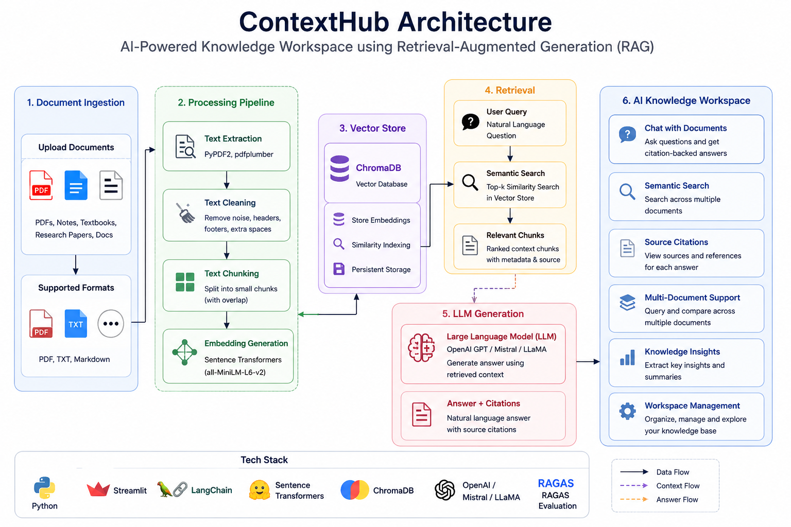

# ContextHub

# Design Document

### A Retrieval-Augmented Generation Platform for Interactive Document Q&A

| Field                 | Details                                      |
| --------------------- | -------------------------------------------- |
| **Author**            | Vanshika Choudhary                           |
| **Segment**           | Foundations of Applied Machine Learning      |
| **Problem Statement** | I2 — Document Q&A (Official Catalog Problem) |
| **Date**              | 24 June 2026                                 |

---

# 1. One-Line Description

A Retrieval-Augmented Generation (RAG) platform that transforms PDFs, notes, textbooks, research papers, and technical documents into an interactive knowledge system capable of answering questions with accurate, context-aware, and citation-backed responses.

---

# 2. Problem Statement

Students, researchers, and professionals regularly work with large collections of documents containing valuable information. Finding specific information manually is often time-consuming and inefficient, especially when working with lengthy textbooks, academic notes, technical documentation, or research papers.

As a Computer Science student, I frequently work with study materials distributed across multiple PDFs and notes. I wanted to build a system that transforms static documents into an interactive knowledge platform where users can ask questions and receive direct, evidence-backed answers.

This project also serves as my foundation for learning Retrieval-Augmented Generation (RAG), Large Language Models (LLMs), Information Retrieval, and modern Generative AI systems, all of which I plan to extend further during my third year.

---

# 3. Data Source

## Primary Source

User-uploaded documents across the following categories:

* Academic Notes and Study Material
* Textbooks
* Research Papers
* Technical Documentation and Manuals
* Reports

### Document Characteristics

* Unstructured textual data
* Variable document lengths (short notes to full textbooks)
* Multi-domain coverage
* Primarily PDF-based input
* Dynamic, user-defined document collections

### Example Documents

* Operating Systems Notes
* Computer Organization Notes
* Machine Learning Notes
* Cloud Computing Notes
* Research Articles (arXiv, IEEE, ACM)
* Technical Manuals

---

# 4. Architecture Overview

The pipeline below illustrates the end-to-end workflow of ContextHub, beginning with document upload and continuing through text extraction, chunking, embedding generation, vector storage, semantic retrieval, answer generation, evaluation, and final presentation within the Streamlit interface.

## Architecture Diagram

### Pipeline Stages

#### Document Sources

The system accepts multiple types of user-uploaded documents:

* PDFs
* Academic Notes
* Research Papers
* Technical Documentation

#### Text Extraction

Text is extracted from uploaded documents using:

* PyPDF2
* pdfplumber

This stage converts raw documents into machine-readable text.

#### Chunking

Large documents are divided into smaller chunks using LangChain text splitters.

Features:

* Configurable chunk size
* Configurable overlap
* Improved retrieval performance

#### Embedding Generation

Each text chunk is converted into dense vector representations using Sentence Transformers (all-MiniLM-L6-v2).

These embeddings capture semantic meaning and enable similarity search.

#### ChromaDB Vector Store

Generated embeddings are stored in ChromaDB, which acts as a persistent vector database.

Functions:

* Embedding storage
* Similarity indexing
* Fast retrieval

#### Semantic Retrieval

When a user submits a query, the retriever performs top-k similarity search to identify the most relevant document chunks.

#### Context Construction

Retrieved chunks are ranked and combined with source metadata to create contextual information for the language model.

#### Large Language Model (LLM)

The retrieved context is provided to an LLM such as:

* OpenAI GPT
* Mistral
* LLaMA

The model generates answers grounded in the retrieved document content.

#### Answer and Source Citations

The system returns:

* Natural language answers
* Source citations
* Supporting document references

This improves transparency and reduces hallucinations.

#### RAGAS Evaluation

Response quality will be evaluated using:

* Context Precision
* Context Recall
* Faithfulness
* Answer Relevance

#### Streamlit Interface

The final user interface allows users to:

* Upload documents
* Ask questions
* Compare documents
* View answers with citations
* Interact with the system through a web application

---

# 5. Tech Stack

| Component            | Choice                                   | Why                                            |
| -------------------- | ---------------------------------------- | ---------------------------------------------- |
| Programming Language | Python 3.11+                             | Industry standard for AI and Machine Learning  |
| Frontend             | Streamlit                                | Fast and lightweight deployment                |
| Document Processing  | PyPDF2 / pdfplumber                      | Reliable PDF text extraction                   |
| Framework            | LangChain                                | RAG workflow orchestration                     |
| Embeddings           | Sentence Transformers (all-MiniLM-L6-v2) | Efficient semantic embeddings that run locally |
| Vector Database      | ChromaDB                                 | Lightweight, open-source, and persistent       |
| LLM                  | OpenAI GPT-3.5/4 or Mistral/LLaMA        | Answer generation                              |
| Evaluation           | RAGAS + Manual Testing                   | RAG quality evaluation                         |
| Visualization        | Matplotlib                               | Analysis and reporting                         |
| Version Control      | Git & GitHub                             | Collaboration and tracking                     |

**Note:** pdfplumber has been added alongside PyPDF2 because it handles tables, columns, and complex layouts more effectively. Chunk size and overlap parameters will be tuned experimentally during Week 2.

---

# 6. Model and Architecture Selection

A Retrieval-Augmented Generation (RAG) architecture has been selected because it grounds responses in retrieved evidence from the user's documents rather than relying solely on the LLM's pre-trained knowledge.

### Why RAG?

* Reduces hallucinations by grounding answers in source documents
* Improves reliability and trustworthiness
* Provides source citations for verification
* Works across multiple domains without retraining
* Adapts to user-provided document collections
* Scales efficiently to large document repositories

### Why Sentence Transformers?

* Runs locally without API costs during development
* Strong semantic similarity performance
* Lightweight enough for deployment on Streamlit Community Cloud

---

# 7. Week 1 Scope

The Week 1 objective focuses on building the ingestion pipeline.

### Tasks

* Set up GitHub repository and project structure
* Create and version project documentation
* Configure the development environment
* Study RAG architecture and chunking strategies
* Build the PDF ingestion pipeline using PyPDF2 and pdfplumber
* Extract text from at least three sample PDFs
* Validate that extracted text is clean and suitable for downstream processing

### Success Criteria

A PDF can be uploaded, processed, and its text successfully extracted and chunked for downstream embedding generation.

---

# 8. Evaluation Metrics

| Category   | Metric            | Description                                        |
| ---------- | ----------------- | -------------------------------------------------- |
| Retrieval  | Context Precision | Fraction of retrieved chunks that are relevant     |
| Retrieval  | Context Recall    | Fraction of relevant chunks successfully retrieved |
| Generation | Answer Relevance  | How well the answer addresses the question         |
| Generation | Faithfulness      | Whether claims are grounded in retrieved context   |
| Generation | Citation Accuracy | Correct attribution to source documents            |
| Manual     | Correctness       | Factual accuracy verified by human review          |
| Manual     | Completeness      | Coverage of key points                             |
| Manual     | Readability       | Clarity and coherence of responses                 |

Evaluation will be conducted using predefined question-answer pairs generated from uploaded documents and assessed using both RAGAS and manual review.

---

# 9. Mini Extension (Week 3)

## Multi-Document Comparison

The system will support querying across multiple documents simultaneously.

### Example Use Case

Upload two versions of the same Operating Systems notes and ask:

* What topics were added in Version 2?
* What topics were removed?
* What changed between the two versions?

### Benefits

* Enhanced document analysis
* Better academic review workflows
* Foundation for future knowledge graph integration

---

# 10. Risks and Open Questions

* Chunk size selection may significantly impact retrieval quality.
* Embedding model choice may affect semantic search performance across domains.
* Large documents may increase retrieval latency.
* Open-source LLMs may produce lower-quality responses than hosted APIs.
* Evaluating answer quality objectively remains a challenging problem.
* pdfplumber may not perfectly handle scanned PDFs; OCR support is deferred to future versions.

---

# 11. Non-Goals (Milestone 1)

The following features are intentionally out of scope for the first milestone:

* OCR support for scanned documents
* Voice interaction
* Fine-tuned custom LLMs
* Multi-modal image understanding
* Agentic workflows

These features are reserved for future iterations.

---

# 12. Definition of Done (Milestone 1)

The project will be considered complete for Milestone 1 when:

* Users can upload PDF documents through the Streamlit interface
* Text extraction works successfully
* Documents are chunked with configurable size and overlap
* Embeddings are generated using Sentence Transformers
* Chunks are stored and retrievable from ChromaDB
* Users can ask natural-language questions
* Relevant context is retrieved successfully
* The LLM generates grounded answers
* Source citations are displayed
* The application is publicly deployed
* A basic RAGAS evaluation report is produced

---

# 13. Deployment Plan

A Streamlit web application will serve as the primary user interface.

Users will be able to:

* Upload documents
* Ask questions
* Receive citation-backed answers
* Compare multiple documents

The final application will be deployed on Streamlit Community Cloud.

ChromaDB will be persisted within the deployed application environment for demonstration purposes.

---

# 14. Future Scope

* OCR support for scanned and image-based PDFs
* Voice-based document interaction
* Multi-modal document understanding
* Knowledge Graph integration
* Personalized learning assistant mode
* Agentic RAG workflows
* Fine-tuned domain-specific embedding models
* Research paper analysis assistant

---

# 15. Third-Year Extension Path

ContextHub can evolve into a comprehensive knowledge intelligence platform by incorporating:

* Multi-document reasoning across large corpora
* Research assistance with citation graph navigation
* Academic tutoring workflows
* Agent-based task execution
* Personal knowledge management with memory
* Domain-specific AI assistants
* Enterprise document intelligence capabilities

This provides a clear pathway from a foundational RAG project to advanced AI systems and internship-ready portfolio work.

---

# 16. Expected Outcome

The final system will transform static documents into an interactive knowledge platform capable of providing accurate, context-aware, and citation-backed answers to natural-language questions.

The project will demonstrate practical end-to-end application of:

* Retrieval-Augmented Generation (RAG)
* Large Language Models (LLMs)
* Vector Databases and Similarity Search
* Information Retrieval and Semantic Search
* Applied Machine Learning in a real-world product
